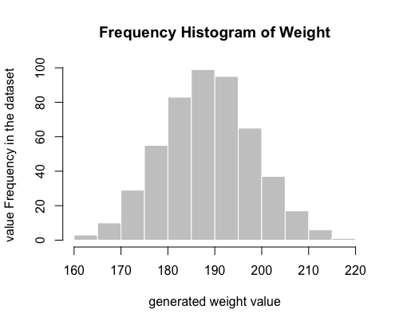

# Data Synthesizer

Provides a highly configurable way to dynamically generate data to mimic an API call, etc.  The data synthesizer is an angular service that is integrated into an Angular project, and the data is created in realtime using a call to the service.  This is a completely client-side service; no server side is needed.

The generation is very fast, typically less than a 100 milliseconds for 500 records and ~10 fields.  The random number generation at the heart of the synthesizer is handled by a WebAssembly module that uses the Mersenne Twister C implementation. The source code for that WebAssembly module is at https://github.com/scheid/prng-wasm

To generate data within your angular project, you create a javascript configuration object to pass to the synthesizer. The config object completely defines the structure of the data, field definitions, how to generate the data for each field, and how much data to generate.  
An angular demo project is located at: https://github.com/scheid/data-synthesizer-demo

Two key differences from most other data generators are:
1. Complex Hierarchical data sets. The ability to create as complex of a hierarchy as you wish; there is no limit to the amount of nested data that you can define.
2. Realtime data generation. the generator and configuration object are integrated into your (angular) project, and you can very easily change anything about the configuration and regenerate a new dataset instantly to get different data, more data, or less data.

The best way to see the capability, is to download the data synthesizer demo, which is an angular cli project that illustrates how to i
incorporate the data synthesizer service and also contains a sample, documented configuration object

Some common lists are also available in a separate NPM package, just as a convenience: https://github.com/scheid/data-synthesizer-common-lists

-----------------------------------------------------------

## Installation and Usage

after installing the data synthesizer via `npm install`, import it into an angular component/module:

```angular2
import { DataSynthesizerService } from 'data-synthesizer';

```


Also, wherever you are defining your configuration object, you will need to import the data synthesizer utils, which define field type, offer some commonly used lists, etc.
```angular2
import { DataSynthUtil } from 'data-synthesizer';

```


Then dependency inject it in to a component:

```angular2

constructor(private dataSynthesizerService: DataSynthesizerService) {

  this.dataSynthesizerService.generateDataset(yourDataConfigObject).subscribe(
      (data) => {
        
        // do something with data object here.

      },
      (err) => {
        console.log('error generating data set', err);
      }
    );

}

```

## The dataset configuration object

The configuration object is the main place that you will do your work creating the data structure, content, etc.

The basic structure of the configuration object is shown below.

`recordsToGenerate` specifies how many rows to generate. The observable from the `generateDataset` function will return an array with
 `recordsToGenerate` array elements.

`seed` is the numeric seed for the random number generator. Having the same seed means the exact same dataset will be generated each time. To change the content of the 
dataset, while keeping all of the rules the same, you just need to change the seed and you'll get a slightly different dataset. 
The range for seed is between 0 and 18,446,744,073,709,551,615 (which is a C unsigned long long range)

`fields` defines the structure of your dataset, which could be a simple, flat, rows x columns structure, but could be very nested and complex, depending on 
your needs.  Just a few field types and definitions are shown below. A more complex configuration is in the demo project.

You can optionally specify a field formatting function to use in conjuction with the specified generation type. Each generated value for a field will be passed 
to the formatting function as an argument, and your function should return the desired new field value.   In the example below, a weight value is generated
according to normal frequency distribution. A formatting function `myFunction` is specified in the field name (using a colon to separate it from the field name).
This is a somewhat silly example, but allows you to see how you can define a function to do whatever you wish to assign the final values.

Another type of field is `CALCULATED` which allows you to assign a field's value based on other field values in the same row/data object. More details on 
that type of field are below.

```angular2

let myDataSynthConfig = {

  recordsToGenerate: 100,
  seed: 38561,

  valueFormattingFunctions: {

    myFunction: (val) => {
      return "you weigh " + val + " pounds."
    }

  },

  fields: [
    {
      name: 'uuid',
      type: DataSynthUtil.UNIQUE_ID_UUID
   },
   
    {
      name: 'weight_lbs:myFunction',
      type: DataSynthUtil.RANDOM_NUMERIC_RANGE_NORMAL,
      mean: 190,
      stDev: 10
    },

    {
      name: 'dateCreated',
      type: DataSynthUtil.DATE_IN_PAST_RANGE,
      minDaysAgo: 1,
      maxDaysAgo: 7
    },
    
    {
      name: 'friendName',
      type: DataSynthUtil.RANDOM_LIST_UNIFORM,
      list: ['Juliet G. Brock', 'Bradley Z. Duran', 'Kelsie G. Deleon', 'Jack C. Rios', 'Candice I. Meyer', 'Ursa L. Trujillo']
    }

  ]


};

```

A more complete, and annotated configuration example is in the demo project, specifically in  
[data-synth-config.ts](https://github.com/scheid/data-synthesizer-demo/blob/master/src/app/data-synth-config.ts)

-----------------------------------

## Field Types

The types of data generation that you can use. These are all listed in the DataSynthUtil class


### DataSynthUtil.RANDOM_NUMERIC_RANGE_UNIFORM

Generates numeric values in the range 0.0 to 1.0 (non-inclusive). Values will be uniformly distributed in that range, meaning 
all values in the range have equal probability of being selected.  Typically, just these raw numbers wouldn't be very useful, but
is included as an option because it provides a basis for you to feed the values into a formatting 
function that outputs more meaningful values.
example:
```
{
  name: 'someNumbs',
  type: DataSynthUtil.RANDOM_NUMERIC_RANGE_UNIFORM
}
```

### DataSynthUtil.RANDOM_NUMERIC_RANGE_NORMAL

Generates numeric values with a specified mean and standard deviation, and fitting a normal frequency distribution.

example:

```
{
  name: 'weight',
  type: DataSynthUtil.RANDOM_NUMERIC_RANGE_NORMAL,
  mean: 190,
  stDev: 10
}
```

As an illustrative example, for the configuration values above, here is what the frequency distribution of the values looks like for 500 generated values.




###  DataSynthUtil.RANDOM_NUMERIC_RANGE_EXPONENTIAL

Generates numeric values that adhere to an exponential frequency distribution.

You supply the rate parameter, lambda. lamba is  1 / mean.

Higher lambda values (1.5 - 2.0) put more of the values toward the zero point, with a steep drop off, lower lambdas (~ 0.5) will show a more flat and spread out distribution

an example with a variable for time spent shopping:

```
{
  name: 'timeSpentShopping',
  type: DataSynthUtil.RANDOM_NUMERIC_RANGE_EXPONENTIAL,
  lamdba: 1.1
}
```


### DataSynthUtil.RANDOM_LIST_UNIFORM 

Each value generated is an item from a list, and each item in the list will have an equal probability of being selected. A single item is selected from the list and assigned as the value.

In the example below, a person name is selected from a list, and each person's name has an equal chance of being selected.

Notice in this example, it illustrates that you can reference a list rather than supplying a literal list.

```
{
  name: 'personName'
  list: myPersonList,
  type: DataSynthUtil.RANDOM_LIST_UNIFORM
}
```


### DataSynthUtil.RANDOM_LIST_WEIGHTED

Each value generated is an item from a list. You supply weight values that determine the probability of each item in the array being selected. The
weights array should have the same number of elements as the list array.  The first element in the weights array is the probability of
selecting the first element in the list. The weights should sum to 1.0.

In the example below, we see a selection of favorite colors. In this example, across all records, approximately 30% (0.30) of the records will have a favorite
color value of blue, 20% will have green, etc.

```
{
  name: 'favoriteColor',
  type: DataSynthUtil.RANDOM_LIST_WEIGHTED,
  list: ['blue', 'green', 'yellow', 'red'],
  weights: [0.30, 0.20, 0.20, 0.30]
}

```


### DataSynthUtil.ITEMS_FROM_SET

This will pick `n` items from a list and assign those items as an array to your field. In the example below, 
the source list is 4 items, and the `itemCount` parameter indicates that, for each record, 2 items should be randomly selected from the list.

```
{
  name: 'friendsNames',
  type: DataSynthUtil.ITEMS_FROM_SET,
  itemCount: 2,
  list: ['Juliet G. Brock', 'Bradley Z. Duran', 'Candice I. Meyer', 'Ursa L. Trujillo']
}

```


###  DataSynthUtil.DATE_IN_PAST_EXACT

If you need a date to be created that is exactly some amount of time in the past, use this.

Supply the `daysAgo` variable value as the number of days in the past.

This example will create a date exactly 14 days ago, from the current date.

```
{
  name: 'dateCreated',
  type: DataSynthUtil.DATE_IN_PAST_EXACT,
  daysAgo: 14
}
```

###  DataSynthUtil.DATE_IN_FUTURE_EXACT

Similar to the above, just in the future.

```
{
  name: 'nextAppointment',
  type: DataSynthUtil.DATE_IN_FUTURE_EXACT,
  daysAhead: 30
}
```


###  DataSynthUtil.DATE_IN_PAST_RANGE


Create dates that are within some range, specified as number of days in the past. You supply the minimum and maximum number of days in the 
past, as 'minDaysAgo' and 'maxDaysAgo' respectively.

Note that decimals are supported in the min and max days values. so a min of 0 and max of 0.5 will be a date/time in the past 12 hours.

Dates will be uniformly distributed across the range.

example:

```
{
  name: 'dateCreated',
  type: DataSynthUtil.DATE_IN_PAST_RANGE,
  minDaysAgo: 7,
  maxDaysAgo: 14
}
``` 


###  DataSynthUtil.DATE_IN_FUTURE_RANGE

Similar to the above, just in the future

example:

```
{
  name: 'dateCreated',
  type: DataSynthUtil.DATE_IN_PAST_RANGE,
  minDaysAhead: 7,
  maxDaysAhead: 14
}
``` 


###  DataSynthUtil.UNIQUE_ID_UUID

Creates UUID v4 values. Use when you need a guaranteed unique id.

example:

```
 {
  name: 'id',
  type: DataSynthUtil.UNIQUE_ID_UUID
}
```


###  DataSynthUtil.UNIQUE_ID_AUTOINCREMENT

Use this for a unique id field. The values will autoincrement starting at 1.  Any nested objects/arrays will still have unique values.

example:

```
{
  name: 'id',
  type: DataSynthUtil.UNIQUE_ID_AUTOINCREMENT
}
   
```

###  DataSynthUtil.OBJECT  

This is the field type that allows you to create any type of complex, nested data structure.

You supply a configuration object to the 'config' parameter, which has the exact same structure/schema
as the main configuration object (except you do *not* supply seed values to nested config objects.)

You can also nest OBJECT field types within other OBJECT field types. there is no limit.

The example below creates a field called 'personPets', which will be an object of fields indicating
whether they have any of three different types of pets. This nested object will be generated for every
record of the main config.  Note that when you specify a 'recordsToGenerate'
value of 1, the field value will be an object, if 'recordsToGenerate' is greater than one, the field value
will be an array of [recordsToGenerate] elements.

```

{

  name: 'personPets',
  type: DataSynthUtil.OBJECT,
  config: {
    recordsToGenerate: 1,

    fields: [
      {
        name: 'hasCat',
        type: DataSynthUtil.RANDOM_LIST_UNIFORM,
        list: [true, false]
      },
      {
        name: 'hasDog',
        type: DataSynthUtil.RANDOM_LIST_UNIFORM,
        list: [true, false]
      },
      {
        name: 'hasFish',
        type: DataSynthUtil.RANDOM_LIST_UNIFORM,
        list: [true, false]
      }
    ]
  }
}

```


###  DataSynthUtil.CALCULATED

A calculated field is different that a field that you use a formatting function with. All non-calculated fields are generated and assigned first,
and then the calculated fields are assigned.  The field value is completely determined by the value you return from the function that you
assign to the 'fn' parameter. The first parameter passed into that function is an object with all fields and values for the record. This allows you to 
assign a variables values based on other values in the same record.  The second parameter is the entire dataset, as calculated up to that point. This will be an array of objects. The third parameter is the record index of the current record in the dataset.  This allows you to refer to other records in a relative way, for example if you want to do the calculated value based on other records relative to the current one.

The example below is sort of a nonsense example, that just combines the person first and last name into a string and uses that as the field value.
The object field names will be the field names in your configuration object.

```
{
  name: 'firstAndLastName',
  type: DataSynthUtil.CALCULATED,
  fn: (rec, dataset, fieldIndex) => (rec.personFirstName + ' ' + rec.personLastName)
},

``` 


###  DataSynthUtil.ITEMS_FROM_SET

Useful if you have a set of items that you want to choose n items from, and ensure the same item is only picked once, like picking cards from a deck.
You will need to supply a list/array to choose from, and the n items selected will be put into an array.


The example below will pick 3 people from the list (the 'itemCount' parameter), and a person cannot be selected more than once.

```
{
  name: 'otherFriendsName',
  type: DataSynthUtil.ITEMS_FROM_SET,
  itemCount: 3,
  list: ['Juliet G. Brock', 'Bradley Z. Duran', 'Kelsie G. Deleon', 'Jack C. Rios', 'Candice I. Meyer', 'Ursa L. Trujillo']
}
```


###  DataSynthUtil.TIME_TODAY_IN_PAST_RANGE

Get a random time for today's date. You can optionally force to be during business hours.

example:

```
{
  name: 'timeDone',
  type: DataSynthUtil.TIME_TODAY_IN_PAST_RANGE,
  forceBusinessHours: true
}
   
```


